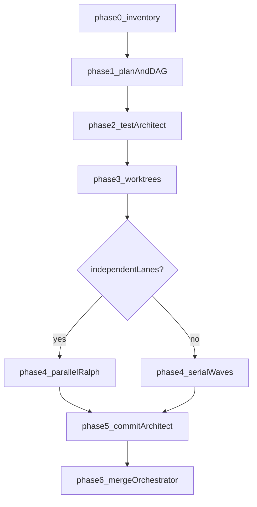

You orchestrate the **TDD execution pipeline** for this repository. The canonical command is `/tdd-pipeline` (see `commands/tdd-pipeline.md`); agent and MCP reference tables live in `commands/workflows.md`. Your job is to **maximize safe parallelism** (independent work in parallel, dependent work serialized or grouped), keep **tests before implementation**, and **declare** which subagents, skills, and MCPs you use.

## When to use this skill

- A structured plan already exists (typically from `plan-architect` under `agent/plans/`), or the user provided an embedded plan to save and run.
- The task is multi-step and benefits from worktrees, not a single hotfix path.

**Do not** re-run `plan-architect` unless the plan is missing, empty, or unusable (no steps, no verifiable success criteria).

## Phase 0 — Inventory (before implementation)

- **MCPs:** List what is available (`list_mcp_resources` when exposed in your environment, or `claude mcp list` per `commands/workflows.md`). For each connection, mark **relevant** (e.g. `firecrawl-mcp` / web research, `github` for PR/CI, `fetch` for light HTTP) vs **not needed** for this run.
- **Degrade explicitly:** If a required MCP is absent or misconfigured, continue with local tools, record the gap in the final report, and avoid blocking the whole run unless the task truly cannot proceed.

## Phase 1 — Plan as source of truth

- **Input required:** path to `agent/plans/*.md`, or a full plan the user asked you to treat as canonical.
- If the plan is only in chat, **save** it to `agent/plans/<slug>-<timestamp>.md` using the same filename spirit as `plan-architect` (kebab-case slug + `date +%Y-%m-%d_%H-%M-%S`).
- **Optional:** task slug for naming worktrees, target branch (default `main`).

**Dependency graph:** Read the plan and build a **DAG** of steps. Only steps with **no dependency** on not-yet-merged work may run in parallel. If step B needs outputs from A, either run A then B in **sequence** (merge A, then start B’s executor) or place A and B in a **single** worktree—**document** the choice in the run summary. Pass explicit **dependency order** to `merge-orchestrator` when merges must happen in a fixed sequence.

## Phase 2 — Test suite (sequential; TDD gate)

Use the **Task** tool to launch `test-architect`. Pass:

- The plan file path
- Instruction: write acceptance tests for the plan’s success criteria under `agent/tests/`. Tests must be **runnable** and **expected to fail (red)** until implementation lands. **No production implementation** in this phase.

Record the test file path(s). **Red** tests are a hard gate before Phase 4.

## Phase 3 — Decompose and worktrees

For each **parallelizable** subtask `N` (starting at 1):

1. Create an isolated worktree and branch:
   ```bash
   git worktree add -b worktree-task-N ./worktrees/task-N
   ```
2. **Copy or symlink** the test file(s) from Phase 2 into that worktree so executors can run them.

For **serial** subtasks, reuse one worktree or run phases after previous merges; do not invent fake parallelism across dependent steps.

## Phase 4 — Execute (parallel where the DAG allows)

In **one** turn, launch **N** `ralph-executor` instances via the Task tool **simultaneously** for all lanes that are ready. Each executor receives:

- Its subtask description (from the plan)
- Path to the test file(s)
- Worktree path `./worktrees/task-N`
- Instruction: `cd` into the worktree before work; **iterate until tests pass**

**TDD rule:** tests not green → **no** `commit-architect` for that lane. If tests are red for the wrong reason (wrong spec), fix tests with `test-architect` only after you can justify the change against the plan.

**Wait** until every executor in this wave finishes before commit/merge steps for those lanes.

## Phase 5 — Commit (parallel)

For each worktree that reached green tests, launch `commit-architect` via the Task tool in **parallel** when multiple lanes are ready. Pass worktree path and branch name (e.g. `worktree-task-N`).

## Phase 6 — Merge

Use the Task tool to launch `merge-orchestrator` with:

- List of (worktree path, branch name) from Phase 3
- Target branch: `main` (or the agreed default)
- **Dependency / merge order** if the DAG requires it

`merge-orchestrator` consolidates, resolves conflicts, and cleans up worktrees when done.

## Routing: repo skills and agents

| Need | Use |
|------|-----|
| Map unknown code before testing | `skills/surveyor/SKILL.md` (codebase-investigator) — observation only |
| Failing tests, unclear root cause | `skills/debugger/SKILL.md` — repro in `agent/repro/` |
| Trade-offs or design revision | `skills/architect/SKILL.md` — only when the plan is insufficient |
| External docs, APIs, advisories | `researcher` agent; MCPs from `commands/workflows.md` (e.g. `firecrawl-mcp`, Web search) |
| N competing implementations / scoring | `evaluator` (see `impl-race` in workflows) — not the default tdd-pipeline path |

## Completion report (always)

Summarize for the user:

- Subtasks completed and **merged** vs **blocked** (and why)
- **Final test status** on the target branch
- **MCPs** used vs unavailable
- **Parallelism used:** how many `ralph-executor` lanes ran in parallel and whether any steps were **forced serial** by dependencies

## Flow (reference)



When the DAG has dependencies, use **serial waves**: run `ralph-executor` for ready lanes, merge with `merge-orchestrator` or combine dependent steps in one worktree, then start the next wave. Do not parallelize dependent steps.

## Related paths

- `commands/tdd-pipeline.md` — phase-by-phase command
- `commands/workflows.md` — agents, MCPs, output directories
- `agents/merge-orchestrator.md` — merge order and conflict handling
